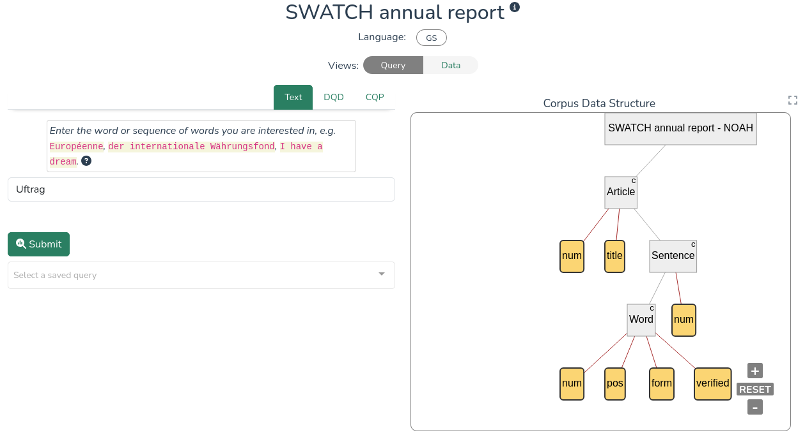
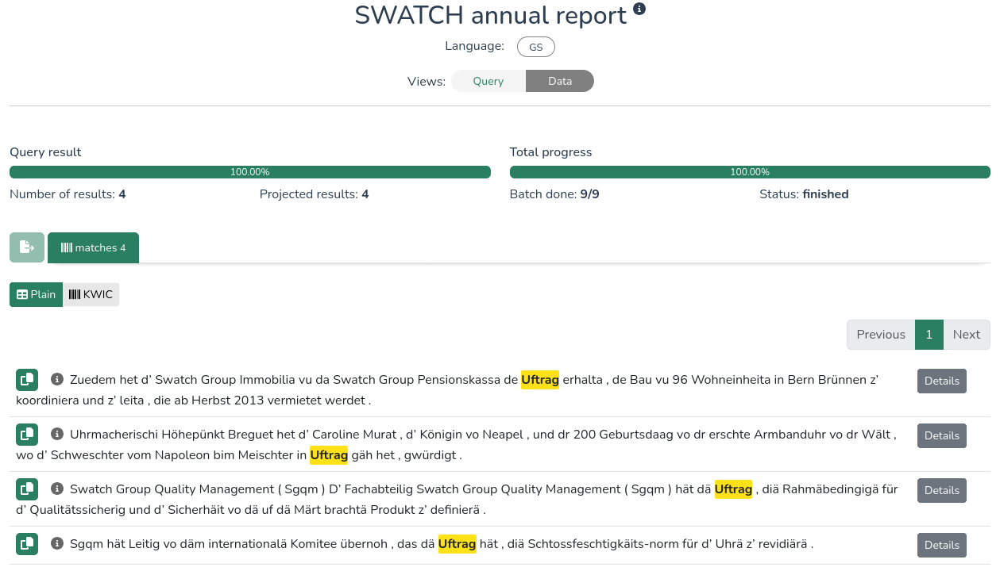
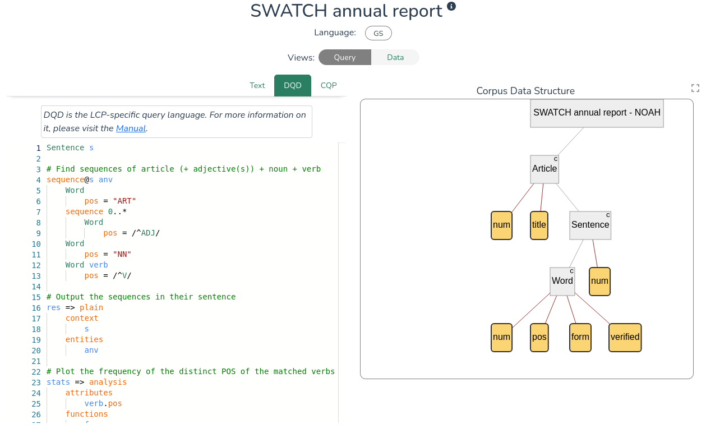

# LiRI Corpus Platform (LCP)

[LCP](https://www.liri.uzh.ch/en/services/LiRI-Corpus-Platform-LCP.html) is a cloud-based solution for handling and querying small to large multimodal corpora developed and maintained by a team at [LiRI](https://www.liri.uzh.ch/en.html), the Linguistic Research Infrastructure at UZH.

  

**1. [Catchphrase](catchphrase.md) is the LCP interface optimized for working with _text_ corpora:** use it when you are working with mono- or multilingual text corpora of any size, or for faster inspection of the text content of audiovisual collections.

**2. [Soundscript](soundscript.md) is optimized for working with _audio_ corpora:** use it for speech corpora that include audio recordings, transcriptions, and any other annotations on the textual or media stream. Results will output text and sound recordings.

**3. [Videoscope](videoscope.md) is optimized for working with _audiovisual/video_ corpora:** use it for viewing and querying audiovisual corpora based on video, that can include annotations on the media stream or text. The interface includes a video player and a timeline annotation preview.

## Corpora

Users can [query](querying.md) corpora from their browser by accessing the public collections, or by [importing their own corpora](importing.md) using a command-line interface. Currently, the following collections of corpora are publicly available in LCP:

**Text corpora (_catchphrase_)**

- [British National Corpus (BNC)](http://www.natcorp.ox.ac.uk/) - English
- [Text+Berg-Korpus - Alpine Journal](http://textberg.ch/site/de/willkommen/) - Swiss German, High German, Romansh, Italian, French, English
- [NOAH's Corpus: Part-of-Speech Tagging for Swiss German](https://noe-eva.github.io/NOAH-Corpus/) - Swiss German
- [What's Up Switzerland](https://whatsup.linguistik.uzh.ch/start) - Swiss German, High German, Romansch, French, Italian
- [The Swiss SMS Corpus](https://sms.linguistik.uzh.ch/) - Swiss German, High German, French, Italian, Romansh

**Audio corpora (_soundscript_)**

- [OFROM - corpus Oral de Français de Suisse Romande](https://ofrom.unine.ch/) - French
- [ArchiMob](https://doi.org/10.48656/496p-3w34) - Swiss German

## First steps

The publicly accessible corpora of LCP are listed at [https://lcp.linguistik.uzh.ch](https://lcp.linguistik.uzh.ch/).

The corpora are color-coded according to their modalities: green indicates text-only corpora, blue indicates audio corpora, and purple corresponds to video corpora. Those open, respectively, in catchphrase, soundscript and videoscope by default; (the text content of) audiovisiual corpora can also be open in catchphrase.

Clicking on the (i) icon of a corpus box brings up more information about the corpus, including the structure of its annotations, which differ across datasets. See more information on corpus structure here: [Corpora in LCP](corpora_in_lcp.md).

### Login: edu-ID

While public corpora do not require log-in, querying semi-private corpora (e.g. Sparcling) requires authentication. Authenticated users can also manage their own private collections of corproa.

The login button can be found in the top-right corner of the page. LCP uses the Switch edu-ID login system, which offers institutional authentication. If you cannot find your institution in any of the provided options, please [create a new Switch edu-ID login](https://eduid.ch/registration).

### Querying corpora

The _Text_ query option lets users search for plain words or sequences of words in a corpus. Below are two side-by-side screenshots of a search and its results for the word `Uftrag` in the _SWATCH annual report_ entry of the Swiss German _NOAH's Corpus_:

  
  

For more advanced searches, LCP uses a dedicated query language called [DQD](dqd.md). LCP provides example queries for each corpus, with comments (highlighted in green) guiding the user through their first query. As you are getting to know the platform and query language, you are invited to play around with the existing queries and see how the results change. Once you have written a valid query, click *Submit* to run the query.

  

To learn more about querying options, see the [*Querying* section](querying.md). To learn more about the format of the results, see the [*Results* page](lcp_results.md).

## Beta-testing

LCP is currently in beta testing. The platform is free to use during this period, and we encourage users to provide feedback regarding discovered bugs or desired features via [lcp@linguistik.uzh.ch](mailto:lcp@linguistik.uzh.ch).

## Further reading

* [Query writing](querying.md)
* [The DQD query language in detail](dqd.md)
* [LCP's Data Model](model.md)
* [How corpora are modelled in LCP](corpora_in_lcp.md)
* [importing your own corpora](importing.md)
* [Corpus management and sharing](corpus_management.md)

