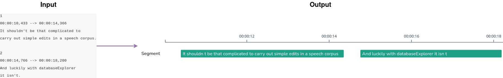
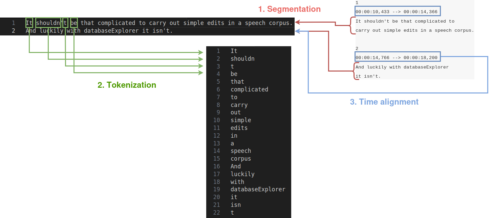

# Import Tutorial

In this tutorial, you will learn how to import subtitled video files into LCP. The first part presents a conceptual overview and the second part applies the logic to the data.

## Files

The video files and their timed transcripts can be downloaded here: https://drive.switch.ch/index.php/s/v3uxBpNkeYuyPE2

Note that none of the Python scripts in this tutorial requires the video files, so you can decide to only download the .srt files. The video files will only be required at the end of part 2, in order to successfully upload the data to _videoScope_.

 - **Part 1: Conceptual overview**
 - [Part 2: Processing the data](import_tutorial_part2.md)

## Part 1: Conceptual overview

  

The image above shows, on the left, the first lines of a transcript file (our input) and, one the right, what we want to obtain in _videoScope_ (our output). To do so, we need to go through 3 main steps:

 - **Segmentation**
 - **Tokenization**
 - **Time alignment**

  

### Segmentation

In LCP, the source text needs to be _segmented_: segments will be the space within which end-users will look for sequences of words. Typically, **segments will correspond to sentences**.

SRT files often have one sentence per numbered block, as in the image above (one sentence in the two text lines of block 1, another sentence in the two text lines of block 2).

( ! ) <strong>Sentences and blocks don't always align</strong>: some sentences will span multiple blocks in an SRT file, and some blocks will contain multiple sentences. This will be something to keep in mind when processing the data

### Tokenization

In addition, each segment is further divided into _tokens_. **Tokens typically correspond to words**, which roughly correspond to space-separated bits of text in the input.

( ! ) <strong>Using just space characters as token delimiters is too simplistic</strong>: as visible in this example, written English has cases like <code>shouldn't</code>, which arguably corresponds to two tokens (<code>should</code> and <code>not</code>). For the sake of simplicity, we will also use <code>'</code> as a delimiter and accordingly map `shouldn't` to two tokens with the forms <code>shouldn</code> and <code>t</code>.

### Time alignment

Time alignment is the process of reporting **where the units previously defined (segments, tokens) fall along the time axis** in the corpus.

SRT files do not provide a good estimate for timecode for words, but we can use the blocks' timecodes to align the segments.

( ! ) 
LCP uses a convention of <strong>25 frames per second</strong> for time-alignment purposes, which is the format in which we will report time alignment values.

( ! ) <strong>Rembember that sentences and blocks don't always align</strong> so using the blocks' time codes is only an <em>approximation</em> of when sentences start and end.

## Plan

In the next part, we will first apply segmentation and tokenization. These will produce a text-only corpus that we can upload to _catchphrase_.

In a second step, we will add annotations to the data:(1) we will report which tokens are preceded by `'` (we will flag them as `shortened`), and (2) we will associate each segment with its original text (including the delimiter characters) for display purposes.

In the last step, we will add time alignment and associate each document with a video file, so we can upload the corpus to _videoScope_.