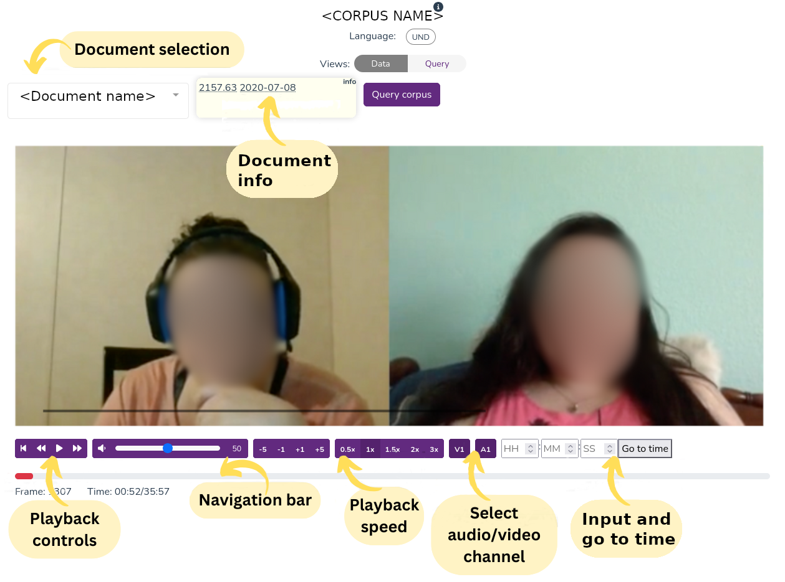
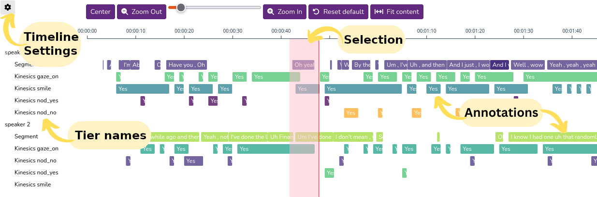
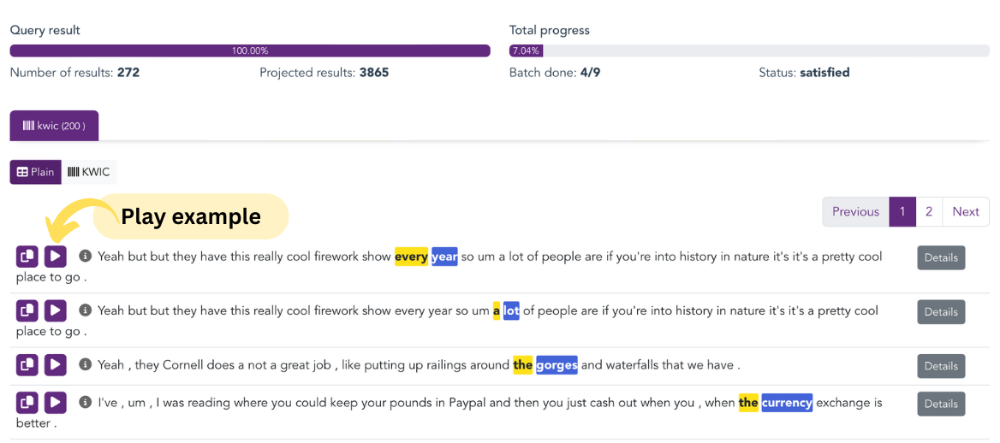

# Multimedia corpora

## Data view

In _soundscript_ and _videoscope_, the _Data_ view is shown first when opening a corpus, to allow for browsing though the media and annotations before querying.

### Media Player

The screenshot below illustrates the media player for a video document; audio documents simply differ by not displaying a video stream. 

  

### Timeline

The timeline shows time-aligned transcripts and other annotations in tiers.

You can select a section of the timeline to play it back; maintain the _Shift_ key pressed to drag the timeline left and right.

You can hover annotation bars to see more information associated to that element.

  

You can control which tiers are displayed in the timeline settings by clicking the gear icon in the top-left corner.

### Results

Each match from the plain results has a _Play_ button which, when clicked, will position the media player to the corresponding timecode, with playback starting immediately.

  

