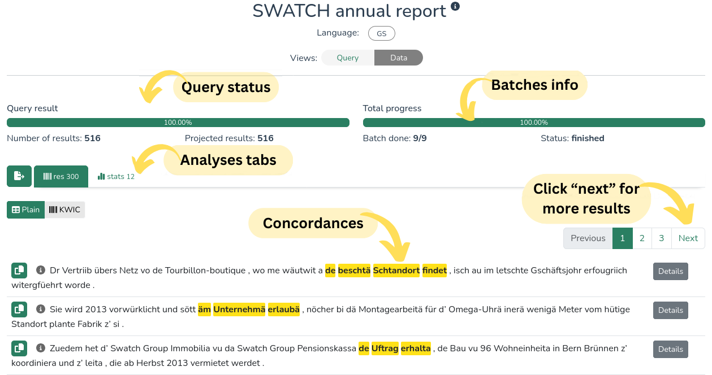
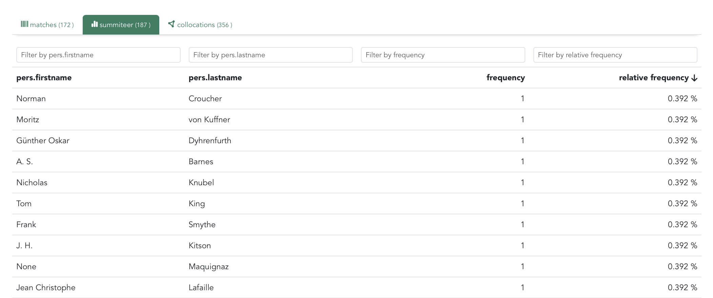
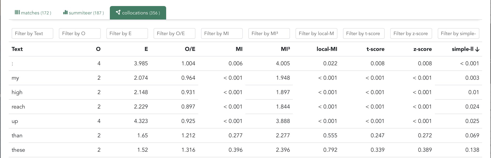

# Results

( ! ) 
This page describes the elements of the LCP <strong>interface</strong> dedicated to the visualization of results. To learn how to control which and how the results a <strong>query</strong> should include, see <a href="results.html">the dedicated DQD page</a>.

After submitting a query, the results will start populating the _Data_ view iteratively.

  

Multimedia corpora include a few additional options, described on [this page](lcp_media).

### Analyses
If your query includes analyses, you will see corresponding anslyses tabs, where you can sort the results based on column values. Variables shown here depend on the definition in the DQD query.

  

( ! ) 
<strong>Pro tip:</strong> if you sort by one column and then press another column header while holding the Shift button, you can sort based on two columns.

### Collocations

Here you can see the statistics regarding collocations for the chosen settings from the DQD query.

  

