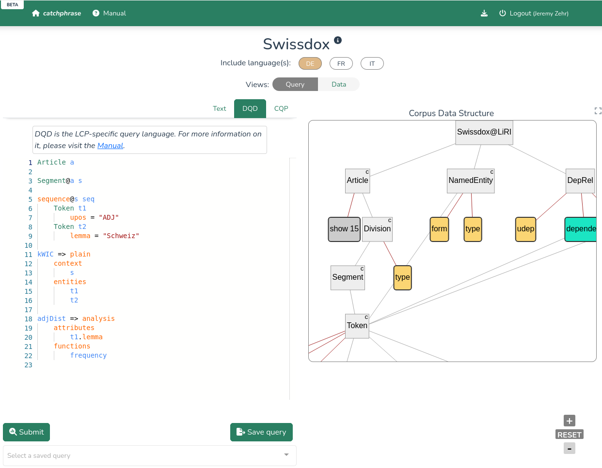

# Querying

To start querying, select the "Query" option from the navigation bar at the top of the page.

Once you are in the query interface, ensure that the corpus you want to query is selected. To write your query you will need to use the [DQD language](dqd.md). 

## Languages

As of June 12, 2025, LCP offers three language options to write your queries:

 - **Text** lets you enter plain text and will return a list of matching (sequences of) words in the corpus. Lemmatized corpora will look to match either the surface form or the lemma (e.g. querying `cat` would match both the forms `cat` and `cats`, assuming both are lemmatized as `cat`)
 - **DQD** lets you write queries in the [DQD language](dqd.md), which was specifically designed for LCP. As such, it allows for the most flexible and powerful queries, and also lets you specify the format of the results you get back.
 - **CQP** lets you write your queries using the [CQP query language](https://cwb.sourceforge.io/files/CQP_Manual.pdf). This will return a list of matching (sequences of) words, just like the plain-text search option.

## Running queries

LCP is designed to work with corpora containing anywhere from **hundreds to billions of words**. Corpora with more than a million words are internally divided into subsections, each of which contains a randomised sample of sentences.

When KWIC queries are run, the LCP engine will query **subsections of the corpus** until a reasonable number of matches are provided (the usual default is currently around 200). Browsing through the pages of KWIC results can cause a paused query to continue, so that more pages are filled. This can be done until a hard maximum (currently around 1000 KWIC results) is reached.

ALternatively, you can click the `Search whole corpus` button to run the query over the entire dataset. If your query requests no KWIC results (i.e. only requests frequency tables and/or collocations), the entire corpus will be searched without pausing.

### Query cache

The LCP system remembers previous queries for a finite amount of time. If you rerun a query that was recently performed, the results can be retrieved from LCP's cache and loaded more quickly.